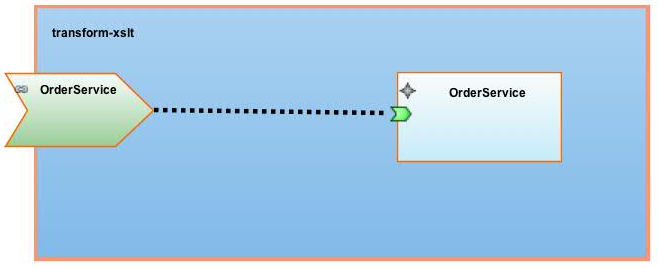
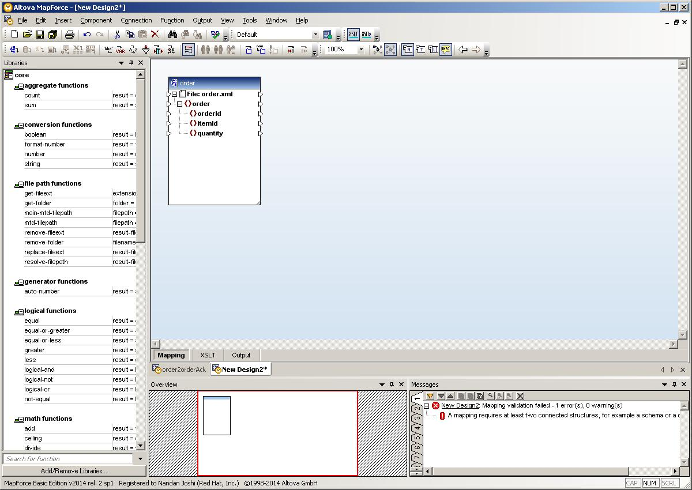
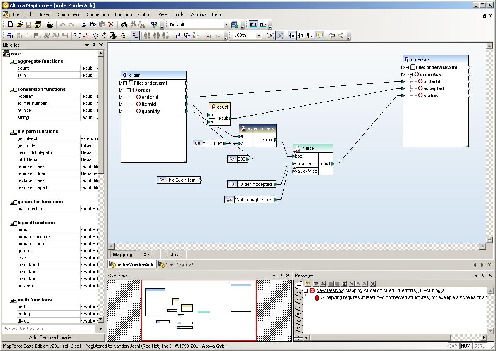
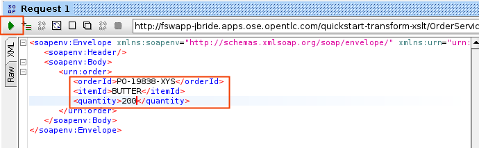

:data-uri:
:toc2:
:rhtlink: link:https://www.redhat.com[Red Hat]
:mapforce: link:http://www.altova.com/download/mapforce.html[this link]

image::images/rhheader.png[width=900]

:numbered!:
[abstract]
== JBoss GPE Reference Architecture:  XSLT Mapping Transformation using external mapping UI tool

:numbered:

Introduction
============

This reference architecture demonstrates a SwitchYard project making use of an xslt transform created via an external mapping GUI.  
The service contained includes a SOAP based composite service binding and a component SwitchYard service called _OrderService_ .
On the response path back to a client, the _OrderService_ returns an _Order_ object while the SOAP based composite service binding expects to return an _OrderAck_ object.
To satisfy this type-mismatch on the response, the SwitchYard project defines an XSLT transform. 

== Pre-Requisites
- A licensed copy of Altova MapForce and access to a Windows machine
- Fuse Service Works 6.0.0.GA installed locally
- JBDS and Maven to build the project
- SOAP UI for testing SOAP request/reply
== Procedure
* For the purposes of this documentation, the name _$REF_ARCH_HOME_ refers to the root directory of this reference architecture.

=== Perform the UI mapping in Altova MapForce

==== Install Altove MapForce
Navigate to {mapforce} to download and install Altova MapForce on your Windows machine. 

Once installed, go through the instructions to get the license for it.

==== Build a map between the input and output XML schemas
Start the MapForce client and open a new project. Insert->XML Schema/File... and select the input .xml file (order.xml). 
A dialog pops up indicating selected XML file does not contain a schema reference and if you want MapForce to create a schema for you. 
Click Yes. 
The schema will appear in the canvas.

Repeat this for the output .xml file (orderAck.xml). Now you are ready to create the mapping. 
Refer to the documentation to create the mapping. The mapping is shown in Figure a.

Export the mapping as XSLT. Go to File->Generate Code in->XSLT 1.0. Name the file orderAMF10.xslt. 
Comment out the part that references the .xsd that MapForce :

-----
<!--			
    <xsl:attribute name="xsi:schemaLocation" namespace="http://www.w3.org/2001/XMLSchema-instance">urn:switchyard-quickstart:transform-xslt:1.0 <file_location>/orderAck.xsd</xsl:attribute> 
-->
-----
  
Copy the xslt to :  $REF_ARCH_HOME/src/main/resource/xslt

=== Modify the SwitchYard project 
To use the newly created .xslt, make the following modifications to the Switchyard project:
- Change the reference to the .xslt in switchyard.xml as per the following:

  <transforms>
       <transform.xslt xmlns="urn:switchyard-config:transform:1.0" from="{urn:switchyard-quickstart:transform-xslt:1.0}order" to="{urn:switchyard-quickstart:transform-xslt:1.0}orderAck" \
xsltFile="xslt/orderAMF10.xslt"/>
  </transforms>

=== Build and deploy the SwitchYard project

1. Build this reference architecture's SwitchYard project:

        mvn clean install

2. Start Fuse Service Works in standalone mode:

        ${FSW_HOME}/bin/standalone.sh

3. Deploy the Quickstart : 

        mvn jboss-as:deploy

=== Test the Deployed Service

Invoke the remotely deployed services by sending a SOAP request using the soapUI open source tool.
 
. Start *soapUI*, and select *File -> New soapUI Project*.
. In the *Initial WSDL/WADL* field, paste the full URL to the WSDL of your newly deployed remote `OrderService`.
. Click *OK*. 
. In the soapUI Navigator, right-click the `Request 1` test case and select *Show Request Editor*.
. In the Request Editor, copy and paste the following request:

=== Expected Output

-----
<SOAP-ENV:Envelope xmlns:SOAP-ENV="http://schemas.xmlsoap.org/soap/envelope/">
   <SOAP-ENV:Header/>
   <SOAP-ENV:Body>
      <orders:orderAck xmlns:orders="urn:switchyard-quickstart:transform-xslt:1.0">
         <orderId>PO-19838-XYZ</orderId>
         <accepted>true</accepted>
         <status>Order Accepted</status>
      </orders:orderAck>
   </SOAP-ENV:Body>
</SOAP-ENV:Envelope>
-----

== To-Do

. Create an example that uses .xsd's instead of WSDL for the XML validation
. Discuss use of supported FSW maven repositories .... reference FSW documentation on configuring settings.xml
. Leverage GPE's Partner Demo System
. How does a user determine the WSDL URL of the deployed service so as to add in SOAP-UI ?
