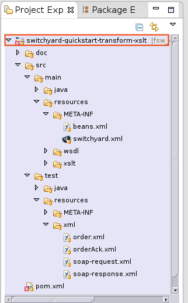

:data-uri:
:toc2:
:rhtlink: link:https://www.redhat.com[Red Hat]
:mwlaboverviewsetup: link:http://people.redhat.com/jbride/labsCommon/setup.html[Middleware Lab Overview and Set-up]
:mvnrepos: link:https://access.redhat.com/documentation/en-US/Red_Hat_JBoss_Fuse_Service_Works/6/html-single/Installation_Guide/index.html#chap-Maven_Repositories[Maven Repositories]
:installintegrationstack: link:https://access.redhat.com/documentation/en-US/Red_Hat_JBoss_Fuse_Service_Works/6/html-single/Installation_Guide/index.html#Install_JBoss_Developer_Studio_Integration_Stack[Install Integration Stack]

image::images/rhheader.png[width=900]

:numbered!:
[abstract]
== XSLT Transform Using External Mapping Tool

:numbered:

Introduction
============

This reference architecture demonstrates the usage of the JBoss Fuse Service Works (FSW) built-in XSLT transformer.

The XSLT stylesheet leveraged by the FSW XSLT transform is built in an external mapping tool (Altova MapForce).

This reference architecture contains a SwitchYard application called `switchyard-quickstart-transform-xslt`.
`transform-xslt` is a slightly modified version of the stock `transform-xslt` quickstart available from JBoss Fuse Service Works.

The `transform-xslt` SwitchYard application defines a SOAP gateway as well as a `Component Service` implemented by a `Java Bean` component.
The response path back to the SOAP client from Component Service -> SOAP binding Service Gateway involves an XSLT tranformation.

image::images/transformxslt.png[]

== Pre-Requisites
The remainder of this documentation provides instructions for installation, configuration and execution of this reference architecture in Red Hat's Partner Demo System.
The following is a list of pre-requisites:

. A licensed copy of Altova MapForce and a Windows machine
. OPENTLC-SSO credentials
+
`OPENTLC-SSO` user credentials are used to log into the Red Hat Partner Demo System (PDS).
If you do not currently have an `OPENTLC-SSO` userId, please email: `OPEN-program@redhat.com`.

. Familiarity with Partner Demo System
+
If you are not already familiar with Red Hat's `Partner Demo System`, please execute what is detailed in the {mwlaboverviewsetup} guide.
Doing so will ensure that you are proficient with the tooling and workflow needed to complete this reference architecture in an OpenShift Platform as a Service environment.

. Familiarity with {fswproduct}
. SOAP UI

== Provision OpenShift Application
Partner Demo System allows for the creation and hosting of JBoss Fuse Service Works in a cloud environment.

This cloud environment is powered by Red Hat's OpenShift Enterprise Platform-as-a-Service (PaaS) environment.
You can access this online lab environment 24/7.
Using this lab environment enables you to focus on developing services and business logic using JBoss middleware instead of installation and configuration details.

=== Provision Fuse Service Works application

. Open the `Openshift Explorer` panel of the `JBoss` perspective of JBDS
. Right-click on the previously created connection to `broker00.ose.opentlc.com`.
+
Using your `OPENTLC-SSO` credentials, a connection to `broker00.ose.opentlc.com` should already exist after having completed the {mwlaboverviewsetup} guide.

. Select: `New -> Application` .
+
Since you have already created a domain from the previous introductory lab, the workflow for creation of a new application will be slightly different than what you are used to.
In particular, the OSE plugin will not prompt you for the creation of a new domain.

. The following `New or existing OpenShift Application` pop-up should appear:
+

.. In the `Name` text box, enter: `fswapp`
.. From the `Type` drop-down, select: JBoss Fuse Service Works 6.0 (rhgpe-fsw-6.0)
.. From the `Gear profile` drop-down, select: pds_medium
.. From the `Embeddable Cartridges` section, select: `MySQL 5.1` or `MySQL 5.5`

. Click `Next`
. A new dialogue appears entitled `Set up Project for new OpenShift Aplication`.
+
Check the check box for `Disable automatic maven build when pushing to OpenShift`.
Afterwards, Click `Next`.

. A new dialogue appears entitled `Import an existing OpenShift application`.
+
Even though it will not be used, you will be forced to clone the remote git enabled project associated with your new OpenShift application.
Uncheck "Use default clone location" and select a location on your local filesystem where the git enabled project should be cloned to.
+

. Click `Finish`
. The OSE plugin of JBDS will spin for a couple of minutes as the remote FSW 6 enabled OpenShift application is created.
. Eventually, the OSE plugin will prompt with a variety of pop-up related details regarding your new application.
Click through all of them except when you come to the dialogue box entitled `Publish fswapp?`.
For this dialogue box, click `No`
+

=== FSW App Verification

. Using the `Remote System Explorer` perspective of JBDS, open an SSH terminal and tail the `fsw/standalone/log/server.log` of your remote FSW enabled OSE application.
. Log messages similar to the following should appear:
+

. Also, in the `Project Explorer` panel of JBDS, the `fswlab` maven project should be listed.

Congratulations!  You have successfully provisioned your FSW 6 enabled application.

== Configuration and Deployment
Altova MapForce is only available on Windows operating systems.
Subsequently, this reference architecture assumes that the development machine in use for all client side applications is Windows.

=== Ensure installation of `IntegrationStack` plugins
The `IntegrationStack` suite of plugins for JBoss Developer Studio is a requirement for this reference architecture.
If you have not already done so, ensure that this suite of plugins is installed as per the {installintegrationstack} section of the FSW installation guide.

=== Ensure proper Maven configuration
A portion of this reference architecture includes a SwitchYard application that will be imported into your JBDS via maven.
Make sure that your default maven `settings.xml` is configured to reference the supported on-line or off-line Fuse Service Works maven repository.
This procedure is discussed in the {mvnrepos} section of the Fuse Service Works Installation Guide.

=== Install Altova MapForce
Navigate to the link (http://www.altova.com/download/mapforce.html) to download and install Altova MapForce on your Windows machine. 

Once installed, go through the instructions to acquire a license.

=== Clone this reference architecture

. Open the `Git` perspective of JBDS.
. In the `Git Repositories` panel, click the link that allows you to `Clone a Git Repository and add the clone to this view`
. A pop-up should appear with a name of `Source Git Repository`
. In the `URI` field, enter the following:
+
-----
https://github.com/jboss-gpe-ref-archs/fsw_external_mapping.git
-----

. Click `Next`
+

. Continue to click `Next` through the various screens
+
On the pop-up screen entitled `Local Destination`, change the default value of the `Directory` field to your preferred location on disk.
For the purposes of the remainder of these instructions, this directory on your local filesystem will be referred to as:  $REF_ARCH_HOME

. On the last screen of the `Clone Git Repository` pop-up, click `Finish`
+
Doing so will clone this `fsw_external_mapping` repository to your local disk

. In JBDS, switch to the `Project Explorer` panel and navigate to:  `File -> Import -> Maven -> Existing Maven Projects`
. In the `Root Directory` field of the `Maven Projects` pop-up, navigate to the location on disk where the `fsw_external_mapping` project was just cloned to.
+

. Click `next` through the various pop-up panels and finally `Finish`.
. Your `Project Explorer` panel should now include the following mavenized projects
+

=== Create the XSLT Mapping File
The purpose of this section of the reference architecture is to generate an XSLT stylesheet given in Altova MapForce given inbound and outbound sample XML payloads.

The sample XML payloads are provided as part of this reference architecture:

. $REF_ARCH_HOME/src/test/resources/xml/order.xml
. $REF_ARCH_HOME/src/test/resources/xml/orderAck.xml

Start the MapForce client and open a new project.

==== Insert sample XML files into Altova MapForce
The following will be executed for both the `order.xml` and `orderAck.xml` sample XML files:

. Navigate to `Insert->XML Schema/File...` 
. As the input file, select:  `$REF_ARCH_HOME/src/test/resources/xml/order.xml`
. A dialog pops up indicating selected XML file does not contain a schema reference and if you want MapForce to create a schema for you.
+
Click Yes.

. The schema will appear in the canvas.
+
image::images/MapFInputSchema.JPG[]

. Repeat this procedure for the output .xml file: orderAck.xml.

==== Generate XSLT from Altova MapForce
The XSLT is now ready to be generated by Altova MapForce.

image::images/MapFIOMapping.JPG[]

. Navigate to File->Generate Code in->XSLT 1.0. 
. Name the file orderAMF10.xslt.

==== Copy and edit XSLT

Now that Altova MapForce has generated the XSLT, this XSLT needs to be included as a resource of the `transform-xslt` SwitchYard project included in this reference architecture.

. Using your File Explorer utility of choice on your Windows machine, copy the newly generated XSLT to the following directory:
+
-----
$REF_ARCH_HOME/src/main/resources/xslt
-----

. Refresh the `switchyard-quickstart-transform-xslt` project in the `Project Explorer` panel of JBDS.
+

. In JBDS, open the `orderAMF10.xslt`
. Edit out the references to `orderAck.xsd`:
+
-----
40      <!--			
41          <xsl:attribute name="xsi:schemaLocation" namespace="http://www.w3.org/2001/XMLSchema-instance">urn:switchyard-quickstart:transform-xslt:1.0 <file_location>/orderAck.xsd</xsl:attribute> 
42      -->
-----

. Save the modified: `orderAMF10.xslt`

=== Review switchyard.xml
The `transform-xslt` SwitchYard application needs to reference the newly generated `orderAMF10.xslt` mapping file.
Verify that this is infact the case:

. In the `Project Explorer` panel of JBDS, open :  `transform-xslt/src/main/resources/META-INF/switchyard.xml`
. Switch to the `Source` tab
. Notice the following starting at about line 18:
+
-----
<transforms>
    <transform.xslt xmlns="urn:switchyard-config:transform:1.0" 
                    from="{urn:switchyard-quickstart:transform-xslt:1.0}order" 
                    to="{urn:switchyard-quickstart:transform-xslt:1.0}orderAck" 
                    xsltFile="xslt/orderAMF10.xslt"/>
</transforms>
-----
+
In particular, notice the reference to the `xslt/orderAMF10.xslt` XSLT mapping file

=== Build and deploy transform-xslt SwitchYard application

. In the `Project Explorer` panel of JBDS, right-click on the `switchyard-quickstart-transform-xslt` project
. Navigate to: `Run As -> Maven Install`
. In the `Console` panel, a `BUILD SUCCESS` log message should appear.
+

. The following jar library should have been created:
+
-----
$REF_ARCH_HOME/target/switchyard-quickstart-transform-xslt.jar
-----

. Open your browser and enter in the URL of the JBoss Management Console of your remote FSW enabled Openshift environment
. Navigate as follows:  _Runtime -> Manage Deployments -> Add -> Choose File
. Select the $REF_ARCH_HOME/target/switchyard-quickstart-transform-xslt.jar artifact.
. Click `Next` followed by `Save`
+

.  Once deployed, the artifact needs to be enabled.
Select the newly deployed `switchyard-quickstart-transform-xslt.jar` artifact and click the _enable_ button.

. Tail your Fuse Service Works `fsw/standalone/log/server.log` and notice the `address` field of the SOAP gateway of the newly deployed OrderService:
+
-----
2014-09-26 07:34:43,058INFO (MSC service thread 1-3)JBWS024061: Adding service endpoint metadata: id=OrderService
 address=http://fswapp-jbride.apps.ose.opentlc.com:80/quickstart-transform-xslt/OrderService
 implementor=org.switchyard.component.soap.endpoint.BaseWebService
 serviceName={urn:switchyard-quickstart:transform-xslt:1.0}OrderService
 portName={urn:switchyard-quickstart:transform-xslt:1.0}OrderServicePort
 annotationWsdlLocation=null
 wsdlLocationOverride=vfs:/content/switchyard-quickstart-transform-xslt.jar/wsdl/OrderService.wsdl
 mtomEnabled=false
 handlers=[org.switchyard.component.soap.InboundResponseHandler]
-----
+
The value of the `address` will be slightly different than what is listed above due to the different domain name of your OpenShift Enterprise account.
The value of this `address` field will be used in the next section of this reference architecture.

. Also notice the following as the last statement of the `fsw/standalone/log/server.log` :
+
--------
JBAS018559: Deployed "switchyard-quickstart-transform-xslt.jar" (runtime-name : "switchyard-quickstart-transform-xslt.jar")
--------

=== Test

Invoke the remotely deployed services by sending a SOAP request using the soapUI open source tool.

. Download and install `soapUI` on your Windows machine 
. Start *SoapUI*
. Navigate to:  `File -> New SOAP Project`.
. In the *Initial WSDL* field, paste the full URL to the WSDL of your newly deployed remote `OrderService` SOAP service.
+

+
NOTE: The value of the URL was determined previously from the `fsw/standalone/log/server.log` when the `transform-xslt` SwitchYard service was deployed to the remote FSW enabled OpenShift Enterprise environment.
Be sure to append `?wsdl` to the end of the SOAP service.

. Click *OK*. 
. In the soapUI Navigator, right-click the `Projects -> fswapp-<your domain name>.apps.ose.opentlc.com -> OrderServiceBinding -> submitOrder ->Request 1` 
. Select *Show Request Editor*.
. In the Request Editor, edit the request payload as follows:
+

. Click the bold green arrow at the top of the Request Editor to invoke the remote `OrderService`
. Tail your Fuse Service Works `fsw/standalone/log/server.log`
+

. The response body returned from the `OrderService` (as seen in SOAP-UI) should be as follows:
+
-----
<SOAP-ENV:Envelope xmlns:SOAP-ENV="http://schemas.xmlsoap.org/soap/envelope/">
   <SOAP-ENV:Header/>
   <SOAP-ENV:Body>
      <orders:orderAck xmlns:orders="urn:switchyard-quickstart:transform-xslt:1.0">
         <orderId>PO-19838-XYZ</orderId>
         <accepted>true</accepted>
         <status>Order Accepted</status>
      </orders:orderAck>
   </SOAP-ENV:Body>
</SOAP-ENV:Envelope>
-----

== To-Do

. Create an example that uses .xsd's instead of WSDL for the XML validation
